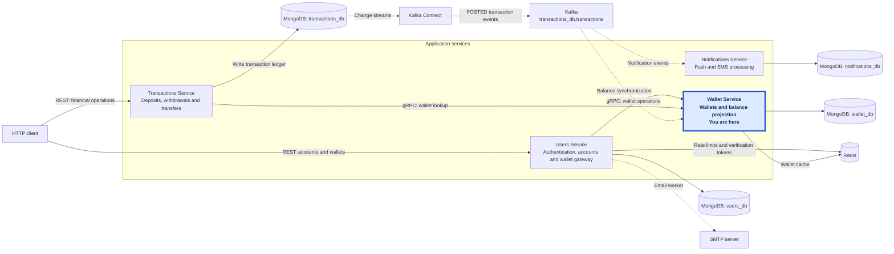
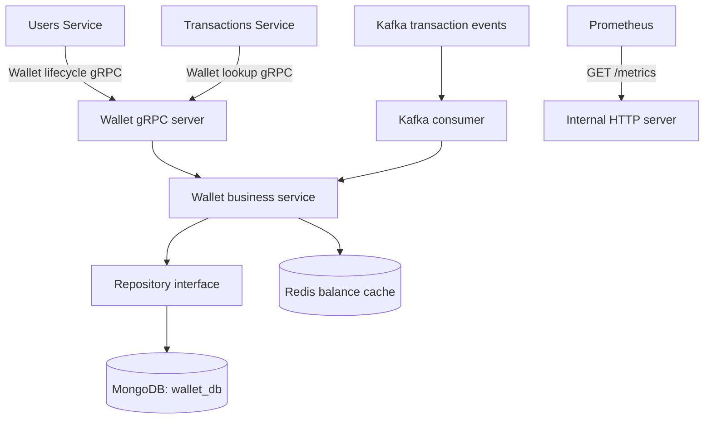

## Wallet & Transactions: system at a glance

This service is part of a larger system for user accounts, wallets, financial transactions, and notifications. **Wallet Service is highlighted below because you are reading its README.**



Solid arrows show requests and data access; dashed arrows show asynchronous processing. Each service owns its MongoDB database. Users handles authentication and account management, delegates wallet operations to Wallet, and sends verification emails through its background worker. Transactions owns the financial ledger; its committed records feed wallet balance synchronization and notification processing through Kafka Connect and Kafka.

The shared monitoring stack uses Prometheus and Grafana for metrics and Jaeger for traces. See the root [`docker-compose.yml`](../docker-compose.yml) for how the system is connected, or explore the [Users](../Users-Service/README.md), [Transactions](../Transactions-Service/README.md), and [Notifications](../Notifications-Service/README.md) service READMEs.

---

# Wallet Service (`svc-wallet`)

An internal service in the Wallet & Transactions project, responsible for wallet accounts and a balance projection of the Transactions ledger.

**Status: work in progress.** Wallet lifecycle operations run over gRPC, and a Kafka consumer synchronizes balances. HTTP serves metrics only; clients manage wallets through the Users REST gateway. Remaining integration and reliability limitations are documented below.

## Responsibilities

- Create zero-balance EGP wallets linked to a Users-service owner ID and Egyptian mobile number.
- List wallets by owner and return wallet details or balances.
- Permanently delete individual wallets or all wallets belonging to a user.
- Consume transaction events and project their `balance_after` into MongoDB.
- Cache balances in Redis and invalidate cache entries after deletion.
- Record HTTP/gRPC metrics, dependency metrics, request logs, and tracing spans.

The service owns wallet records in `wallet_db`. Transactions owns the financial ledger and decides whether deposits, withdrawals, and transfers are allowed. Users owns authentication, account data, and client-facing wallet ownership checks.

## Architecture



### Layers and dependencies

| Layer | Location | Responsibility |
|---|---|---|
| Startup | `cmd/` | Load configuration, connect dependencies, wire components, run HTTP/gRPC servers and the Kafka consumer, handle shutdown. |
| gRPC transport | `api/grpcserver/` | Implement the shared Wallet contract, translate DTOs, map errors, record RPC logs and metrics. |
| HTTP transport | `api/rest/` | Serve metrics; retain disabled business handlers and historical Swagger route definitions. |
| Business logic | `internal/wallet/` | Wallet creation, listing, deletion, balance lookup, event processing, and repository interface. |
| Persistence | `external/mongodb/` | Create indexes, query wallets, delete records, and apply atomic balance updates. |
| Cache | `external/redis/` | Construct the Redis client used directly by the business service. |
| Messaging | `external/kafka/consumer/` | Decode CDC events, normalize transaction IDs, retry processing, and mark offsets. |
| Utilities | `util/` | Structured logging, Prometheus metrics, and OpenTelemetry setup. |

Repository and event-processor interfaces separate persistence and consumption from business operations. The service directly uses the Redis client.

### Request and event pipelines

```text
gRPC:          OpenTelemetry + observability interceptor -> RPC -> Service -> Repository/cache
HTTP:          RequestLogger -> MetricsMiddleware -> Router -> /metrics
Kafka:         Decode -> Normalize transaction ID -> Retry service processing -> Mark message
```

Both Users and Transactions use internal gRPC without transport TLS in the current project. Wallet does not validate user JWTs; Users performs its client-facing ownership checks before calling Wallet.

## Files

```text
Wallet-Service/
|-- README.md
|-- .github/workflows/ci.yml          # Build and package tests
`-- svc-wallet/
    |-- cmd/main.go                  # Configuration, wiring, servers, consumer, shutdown
    |-- api/
    |   |-- grpcserver/
    |   |   |-- wallet_server.go      # RPC implementations, error mapping, observability
    |   |   `-- wallet_server_test.go # Wallet lifecycle tests with a memory repository
    |   `-- rest/
    |       |-- routes.go            # Active /metrics; commented business/Swagger routes
    |       |-- routes_test.go        # Checks the metrics-only HTTP surface
    |       |-- controller.go
    |       |-- request_response_handler.go
    |       `-- middleware.go        # HTTP logging and metrics
    |-- internal/wallet/
    |   |-- model.go                 # Wallet schema and domain errors
    |   |-- dto.go                   # DTOs, event fields, phone/national-ID validation
    |   |-- repository.go            # Persistence interface
    |   `-- service.go               # Wallet lifecycle, cache, and balance projection
    |-- external/
    |   |-- mongodb/
    |   |   |-- connection.go
    |   |   `-- repo.go              # Indexes, queries, deletion, atomic balance updates
    |   |-- redis/client.go
    |   `-- kafka/consumer/consumer.go
    |-- util/                        # logger/, metrics/, tracer/
    |-- tests/                       # Historical REST integration suite and runner
    |-- docs/                        # Historical Swagger files; UI is disabled
    |-- Dockerfile
    |-- go.mod / go.sum
    |-- .ENV.example
    |-- .air.toml / .golangci.yml
    `-- .dockerignore / .gitignore
```

Shared RPC definitions live in [`../Contracts/wallet/v1/wallet.proto`](../Contracts/wallet/v1/wallet.proto). The root [`docker-compose.yml`](../docker-compose.yml) wires the wider system, and [Kafka Connect](../kafka-connect/README.md) documents the CDC pipeline.

## Main flows

### Wallet creation and listing

1. Users calls `CreateWallet` with `user_id` and `phone_number`.
2. Wallet validates the owner ID as a MongoDB ObjectID and the mobile number.
3. Insert a wallet with balance `0`, currency `EGP`, the owner ID, and an empty `processed_refs` array.
4. Return `wallet_id`, `balance`, and `created_at`.
5. `GetUserWallets` queries by `user_id`, sorts by creation time, and returns each wallet's ID, phone, balance, currency, and creation time.

The unique phone index prevents multiple wallets sharing a number. Wallet does not enforce Users' three-wallet limit or check that the requested owner exists in Users. Gateway-created wallets leave the legacy owner-name, national-ID, and birth-date fields empty.

### CDC balance synchronization

1. Transactions commits a `POSTED` ledger entry with `balance_after`.
2. Kafka Connect captures the insert and publishes it to `transactions_db.transactions`, keyed by `wallet_id`.
3. The consumer decodes the event and normalizes an `_id` string containing MongoDB extended JSON.
4. The repository atomically matches `phone_number` and an event ID absent from `processed_refs`, sets the balance to `balance_after`, and retains the last **80** processed IDs.
5. If the ID is already present, the repository returns the existing wallet state.
6. The service updates the Redis balance hash when the event timestamp is at least as recent as the cached timestamp.

The consumer makes up to **10 processing attempts**, with **500ms** sleeps after failures. Malformed JSON, empty IDs, and messages still failing after the final attempt are logged and marked for offset advancement. There is no dead-letter queue.

The MongoDB update sets an absolute balance rather than adding the transaction amount. Deduplication is limited to the retained IDs; MongoDB does not enforce an event sequence or timestamp when updating the projection.

### Balance reads and deletion

- `GetWalletBalance` reads `wallet:<wallet_id>` from Redis first. A miss loads MongoDB and populates the hash's `balance` and `last_time` fields.
- Redis read failures fall back to MongoDB. Malformed cached numeric fields return an error; the cache is not automatically repaired.
- `DeleteWallet` deletes the MongoDB record, then attempts to delete its cache key. A missing wallet returns `NotFound`.
- `DeleteUserWallets` reads owner-scoped IDs, calls `DeleteMany`, and invalidates their cache keys. Repeating the bulk deletion succeeds.
- Redis invalidation failures are logged without rolling back deletion.

The retained `ModifyBalance` RPC calls the same absolute-balance repository update, despite its legacy `amount` field name. It rejects zero at the RPC boundary, does not refresh Redis, and is not the normal Transactions balance path.

## Data and validation

| Storage | Main fields | Indexes / behavior |
|---|---|---|
| MongoDB `wallets` | `_id`, `user_id`, `phone_number`, `owner_name`, `balance`, `currency_code`, `national_id`, `birth_date`, optional `family_id`, `processed_refs`, `created_at`, `updated_at` | Unique `unique_phone` on `phone_number`; non-unique `wallets_by_user` on `user_id`. |
| Redis `wallet:<wallet_id>` | Hash fields `balance`, `last_time` | Timestamp is epoch milliseconds. No expiry is configured by the service. |

- Owner and wallet IDs used by lifecycle methods must be valid MongoDB ObjectID strings.
- Mobile numbers contain 11 digits and start with `010`, `011`, `012`, or `015`; surrounding spaces are trimmed.
- The active creation RPC fixes currency to `EGP`.
- The disabled REST creation path also validates owner name, currency length, and national ID, then derives birth date. It is retained source rather than an active API.
- Financial capacity and overdraft checks belong to Transactions. The shared maximum constant is `9000000000000000`; the projection update does not independently enforce it.
- Wallets created before owner IDs were added may lack `user_id` and will not appear in owner-scoped listing or bulk deletion.

## gRPC and HTTP endpoints

The active contract is `wallet.v1.WalletService`, normally listening on **50051**.

| RPC | Main request fields | Success |
|---|---|---|
| `CreateWallet` | `user_id`, `phone_number` | `wallet_id`, `balance`, `created_at` |
| `GetUserWallets` | `user_id` | `wallets`: ID, phone, balance, currency, creation time |
| `GetWalletBalance` | `wallet_id` | `wallet_id`, `balance`, `updated_at` |
| `DeleteWallet` | `wallet_id` | `success: true` |
| `DeleteUserWallets` | `user_id` | `success: true`, including an empty result |
| `GetWallet` | `phone_number` | `wallet_id`, `owner_name`, `balance`; used by Transactions |
| `ModifyBalance` | `phone_number`, `amount`, `referenceID` | `wallet_id`, `balance`, `updated_at`; legacy compatibility |

HTTP normally listens on **8000**:

| Method | Path | Purpose |
|---|---|---|
| GET | `/metrics` | Internal Prometheus metrics |

Wallet business REST routes and Swagger UI are commented out. No dedicated health endpoint is registered. In Compose, both Wallet ports are exposed internally and neither is published to the host. Use the [Users wallet routes](../Users-Service/README.md#wallet-proxy-routes) for client-facing HTTP operations.

### Error responses

Lifecycle RPCs use the following mappings:

| Error | gRPC code |
|---|---|
| Invalid user ID, wallet ID, phone number, or national ID | `InvalidArgument` |
| Wallet not found | `NotFound` |
| Duplicate phone number | `AlreadyExists` |
| Insufficient balance or maximum capacity error | `FailedPrecondition` |
| Canceled request / expired deadline | `Canceled` / `DeadlineExceeded` |
| Unexpected dependency error | `Internal`; details hidden |

The retained `GetWallet` and `ModifyBalance` methods use their own error handling rather than the shared lifecycle mapper. Capacity/overdraft errors remain defined, but normal financial validation runs in Transactions.

## Logging, metrics, and tracing

Zerolog writes console logs by default and JSON at INFO level when `APP_ENV=production`. HTTP completion logs and gRPC interceptor logs record the request or method, status/result, and elapsed duration. Context-aware logs include `trace_id` and `span_id`.

The active gRPC server uses OpenTelemetry instrumentation; service and repository operations create child spans. Kafka processing starts an independent trace per message because CDC events do not carry the original request's trace context. An optional OTLP HTTP endpoint exports traces to Jaeger.

`/metrics` exposes:

- HTTP request counts, duration, and request/response sizes.
- `grpc_requests_total` and `grpc_request_duration_seconds`.
- `mongodb_operation_duration_seconds`.
- `redis_operations_total` by operation and outcome.
- `kafka_messages_total`, `kafka_retries_total`, and `kafka_process_duration_seconds`.

HTTP labels use route patterns; dependency labels do not contain wallet IDs or phone numbers. Consumer failure logs include topic, partition, and offset without the raw payload.

## Configuration and local development

The module declares Go **1.26.5**. Local development needs MongoDB, Kafka, Redis for caching, and the published Contracts dependency. CDC testing also needs MongoDB change streams and Kafka Connect.

| Variable | Default / requirement |
|---|---|
| `MONGO_URI` | Required. MongoDB connection string. |
| `MONGO_DB_NAME` | `wallet_db` |
| `SERVER_PORT` | `8000`; internal HTTP metrics. |
| `GRPC_SERVER_PORT` | `50051` |
| `KAFKA_BROKERS` | Required; use `localhost:9092` locally or `kafka:9092` inside Compose. |
| `KAFKA_GROUP_ID` | Required; e.g. `wallet-balance-consumer`. Use a different group from Notifications. |
| `KAFKA_TOPIC` | Required; `transactions_db.transactions`. |
| `REDIS_ADDR` | `localhost:6379`; Compose overrides this to `redis:6379`. |
| `APP_ENV` | `production` enables JSON/info logging; other values use debug console logging. |
| `OTEL_EXPORTER_OTLP_ENDPOINT` | Optional host:port, e.g. `localhost:4318` or `jaeger:4318`. |

From this directory:

```powershell
cd svc-wallet
Copy-Item .ENV.example .ENV # First-time setup only; preserve an existing .ENV
# Fill in MongoDB, Kafka, Redis, and optional tracing settings.
go run ./cmd
```

Startup loads `.ENV` before logging/tracing, checks MongoDB, creates indexes, and constructs the Kafka consumer group. Redis is created without a startup ping. The current broker setting is passed as one address; comma-separated broker parsing is not implemented.

From the workspace root:

```powershell
docker compose build wallet
docker compose up -d wallet
```

The Compose setup uses each service's `.ENV`. Configure Kafka addresses for the Docker network; the local startup commands require broker metadata reachable from the host.

### Current integration limits

- Balances are eventually consistent with the ledger. A successful Transactions response can precede the Wallet projection update.
- Deletion is a hard delete and is not coordinated with Transactions. Historical ledger entries can retain deleted IDs, in-flight events can target a deleted phone, and remaining balances are not protected.
- Reusing a phone after deletion can reconnect a new wallet to old phone-keyed ledger/events. Treat the current deletion flow as project account-data cleanup.
- Users' local wallet-ID array and Wallet's owner records are separate writes; there is no synchronization or reconciliation process.
- Cache invalidation is best effort. A failed delete can leave a stale cache entry with no service-configured expiry.
- Historical REST integration tests need migration before they can validate the active gateway/gRPC setup.

## Deferred issues to revisit

These items are documented follow-up work, not implemented fixes.

- [ ] **Preserve projection order during replay.** Add a durable ordering check and a replay strategy that remains correct after an ID leaves the 80-entry deduplication window.
- [ ] **Recover from consumer failures.** Retain or route events that exhaust retries instead of marking them for advancement without a recovery queue.
- [ ] **Make cache recovery reliable.** Define expiry, repair malformed hashes, and retry invalidation after MongoDB deletion.
- [ ] **Coordinate financial account closure.** Define how balances, pending operations, historical ledger records, and phone reuse interact with wallet deletion.
- [ ] **Retire or align the legacy modification RPC.** Its absolute-balance behavior and cache handling differ from the apparent amount-based interface.
- [ ] **Migrate historical tests and owner data.** Use Users REST or Wallet gRPC, and handle records lacking `user_id`.

## Verification

From `svc-wallet`:

```powershell
go build ./...
go test ./...
```

| Test file | Coverage |
|---|---|
| `svc-wallet/api/grpcserver/wallet_server_test.go` | Wallet creation, owner-scoped listing, balance lookup, single/bulk deletion, and lookup after deletion using a memory repository. |
| `svc-wallet/api/rest/routes_test.go` | Metrics remains available while business and Swagger routes stay disabled. |

The package tests run without live MongoDB or Redis. Wallet CI runs dependency download, build, and package tests with Go 1.26.5.

The `integration`-tagged [historical wallet suite](svc-wallet/tests/wallet_acid_test_docs.md) targets the disabled Wallet REST API. Its retained command is `go test -v -tags=integration -count=1 ./tests/`; it is not a working validation path for the current default deployment. End-to-end verification needs live dependencies and gateway/gRPC tests covering ledger-to-Wallet convergence.
